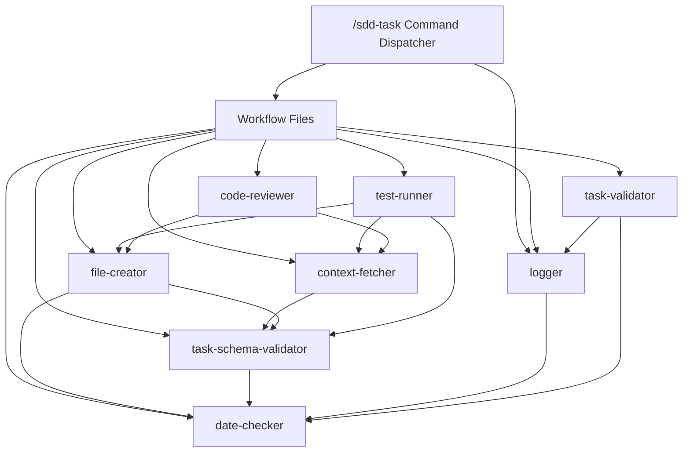

# Agent Dependency Flow Documentation

## Overview
This document maps the dependencies and interactions between agents in the Agent-SDD framework, ensuring proper error handling and workflow continuity.

## Current Agent Dependencies

**Updated**: 2025-08-25 - Based on actual agent frontmatter declarations

**Core Dependencies (no dependencies)**:
- `date-checker` → none

**Primary Dependencies**:
- `task-schema-validator` → date-checker
- `logger` → date-checker
- `task-validator` → logger, date-checker

**Secondary Dependencies**:
- `context-fetcher` → task-schema-validator
- `file-creator` → task-schema-validator, date-checker

**Complex Dependencies**:
- `code-reviewer` → context-fetcher, file-creator
- `test-runner` → context-fetcher, file-creator, task-schema-validator

## Agent Dependency Map



## Agent Interaction Patterns

### 0. Task Validation Flow (User Verification)
**Primary Agent**: `task-validator`
**Dependencies**:
- `logger` (for completion logging after user approval)
- `date-checker` (for completion timestamps)

**Error Handling**:
- If user rejects changes → Return feedback for iteration
- If logger fails after approval → Mark as validation_approved_but_logging_failed
- If max iterations exceeded → Suggest rollback or different approach
- Success → Complete validation with logged entry

**Phases**:
1. **Present Changes**: Show git diffs and file modifications to user
2. **Collect Feedback**: Process user approval/rejection responses
3. **Handle Iteration**: Manage improvement cycles for rejected changes
4. **Complete Logging**: Invoke logger agent only upon user approval

**Usage**: Only invoked at end of `--fix`, `--update`, and `--edit` workflows

### 1. Logger Flow (Context Awareness)
**Primary Agent**: `logger`
**Dependencies**:
- `date-checker` (for timestamp formatting)

**Error Handling**:
- If `date-checker` fails → Continue with fallback timestamp
- If changelog.md missing → Create new file automatically
- If write fails → Continue execution (non-critical)
- Success → Update changelog with brief summary

**Phases**:
1. **Pre-Task**: Read changelog for context (read mode)
2. **Post-Task**: Write task completion summary (write mode)
3. **Via Task-Validator**: Invoked by task-validator upon user approval for `--fix`, `--update`, `--edit`

### 2. File Creation Flow
**Primary Agent**: `file-creator`
**Dependencies**: 
- `date-checker` (for directory naming)
- `task-schema-validator` (for tasks.json validation)

**Error Handling**:
- If `date-checker` fails → Return error [ERR_004]
- If `task-schema-validator` fails → Return error [ERR_003]
- Success → Create files and return confirmation

### 3. Task Schema Validation Flow
**Primary Agent**: `task-schema-validator`
**Dependencies**:
- `date-checker` (for date field validation)

**Error Handling**:
- If date validation fails → Include in errors array
- If schema validation fails → Return detailed error list
- Success → Mark as valid

### 4. Context Fetching Flow
**Primary Agent**: `context-fetcher`
**Dependencies**:
- `task-schema-validator` (for tasks.json validation)

**Error Handling**:
- If file not found → Return error [ERR_004]
- If task validation fails → Include validation errors
- Success → Return extracted content with validation status

### 5. Test Execution Flow
**Primary Agent**: `test-runner`
**Dependencies**:
- `context-fetcher` (to get tasks.json)
- `file-creator` (to update task status)
- `task-schema-validator` (to validate updates)

**Error Handling**:
- If `context-fetcher` fails → Return error [ERR_004]
- If tests fail → Return error [ERR_007] with details
- If validation fails → Return error [ERR_003]
- Success → Update task status to completed

### 6. Code Review Flow
**Primary Agent**: `code-reviewer`
**Dependencies**:
- `context-fetcher` (to get theme standards)
- `file-creator` (to update task status and create backups)

**Error Handling**:
- If standards file missing → Return error [ERR_004]
- If compliance issues found → Return error [ERR_008] with report
- Success → Mark as compliant and update task status


## Error Recovery Strategies

### Cascading Failures
When a dependent agent fails:
1. **Immediate Stop**: Stop execution and report the first failure
2. **Error Context**: Include which agent failed and why
3. **Recovery Suggestion**: Provide actionable next steps

Example:
```json
{
  "status": "failed",
  "error_code": "ERR_003",
  "failed_agent": "task-schema-validator",
  "reason": "Invalid task ID format",
  "suggestion": "Fix task ID to match pattern: [A-Z]{2,5}-[0-9]{1,4}"
}
```

### Partial Success Handling
For workflows with multiple independent operations:
1. **Continue on Non-Critical**: Continue if non-critical agents fail
2. **Aggregate Results**: Collect all results before reporting
3. **Status Summary**: Report overall status and individual statuses

Example:
```json
{
  "overall_status": "partial_success",
  "operations": {
    "file_creation": "success",
    "validation": "success",
    "tests": "failed",
    "git_commit": "skipped"
  }
}
```

## Agent Communication Protocol

### Input Validation
All agents must:
1. Validate required inputs exist
2. Check input types and formats
3. Return clear error if validation fails

### Output Consistency
All agents must return:
```json
{
  "status": "success|failed|skipped",
  "data": {}, // Agent-specific data
  "error": null, // Or error details
  "error_code": null // Or specific error code
}
```

### Timeout Handling
- Default timeout: 30 seconds per agent
- Long operations (test-runner): 120 seconds
- Git operations: 60 seconds

## Best Practices

1. **Always Check Dependencies First**
   - Verify dependent agents are available
   - Check required files exist
   - Validate environment (e.g., git repo exists)

2. **Fail Fast with Clear Messages**
   - Don't continue on critical errors
   - Provide specific error codes
   - Include actionable recovery steps

3. **Log Agent Interactions**
   - Track which agents were called
   - Record input/output for debugging
   - Maintain audit trail for workflows

4. **Handle Edge Cases**
   - Empty or missing files
   - Network failures (for git operations)
   - Concurrent modifications
   - Large file handling

## Dashboard Integration

The dashboard should:
1. Display agent dependency chains visually
2. Show real-time agent status during execution
3. Highlight failed agents in red
4. Provide drill-down into error details
5. Suggest recovery actions based on error codes